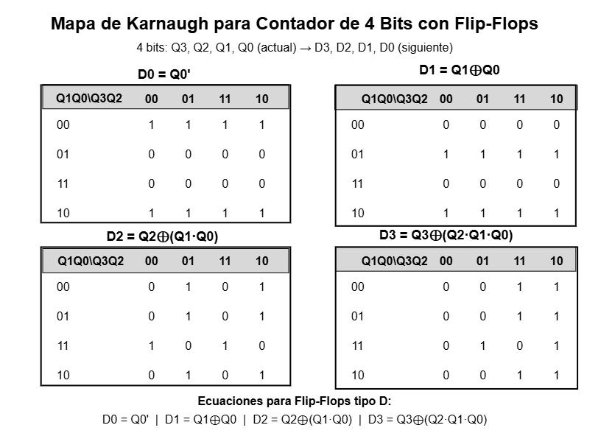

# Universidad de San Carlos de Guatemala

## Facultad de Ingeniería
### Escuela de Ciencias y Sistemas
### Organización Computacional
### Sección C

# PRACTICA NO. 3 TIKALPARK

## Grupo No. 1

- 202300350 – Abdiel Fernando José Otzoy Otzín → 100%
- 202300596 – Xavi Alexander De León Perdomo → 100%
- 202300694 – Eduardo Sebastian Gutierrez Felipe → 100%
- 202300850 – Julio Alfredo Herrera Orantes → 100%
- 202308227 – Christian David Chinchilla Santos → 100%

## INDICE

1. [INTRODUCCION](#introduccion)
2. [DESCRIPCION DEL PROBLEMA](#descripcion-del-problema)
3. [PROCEDIMIENTO](#procedimiento)
4. [DIAGRAMAS DE LOS DISEÑOS DESARROLLADOS](#diagramas-de-los-disenos-desarrollados)
5. [EQUIPO UTILIZADO](#equipo-utilizado)
6. [PRESUPUESTO](#presupuesto)
   - [Gastos](#gastos)
   - [Aportes](#aportes)
7. [CONCLUSIONES](#conclusiones)

## INTRODUCCION

En la presente práctica se desarrolla un prototipo de una torre de parqueo automatizada, con el objetivo de aplicar los conocimientos adquiridos en lógica combinacional y secuencial, así como en el uso de dispositivos electromecánicos. Este proyecto permite poner en práctica conceptos fundamentales de electrónica digital, incluyendo el uso de Mapas de Karnaugh, flip-flops y sensores, sin recurrir al uso de microcontroladores en ciertas etapas específicas.

El diseño del sistema simula el funcionamiento de un estacionamiento automatizado con tres niveles, cada uno con una cantidad específica de espacios disponibles. Se han integrado mecanismos como garitas automáticas, control de acceso mediante tickets, sensores de ocupación y medidas de seguridad para la detección de intentos de acceso no autorizado. Además, se han implementado procesos de conteo de vehículos y control de apertura de barreras mediante circuitos lógicos.

A lo largo del informe, se detallarán los procedimientos seguidos para el diseño y la simulación del sistema en Proteus, los circuitos implementados y la documentación técnica que sustenta la solución propuesta. Finalmente, se presentan las conclusiones obtenidas con base en la funcionalidad del prototipo y su aplicación en escenarios reales de automatización de estacionamientos.

## DESCRIPCION DEL PROBLEMA

El **Hotel Grand Tikal Futura** ha identificado la necesidad de optimizar la gestión de estacionamientos dentro de sus instalaciones, con el objetivo de mejorar la experiencia de sus clientes y aumentar la eficiencia del uso del espacio disponible. Para ello, ha solicitado el diseño y desarrollo de un **prototipo de torre de parqueo automatizada**, similar a la de su competencia en Miraflores.

El problema central radica en la implementación de un **sistema automatizado de acceso y control de espacios** que permita la gestión eficiente de vehículos en tres niveles de estacionamiento. Para lograrlo, se requieren diversas funcionalidades, tales como:

- **Control de acceso** mediante una garita automática que emita tickets y active una barrera de ingreso.
- **Registro de ocupación** en tiempo real, con contadores de vehículos por nivel y en la torre en general.
- **Gestión de disponibilidad**, de modo que cuando un nivel se llene, se redirija automáticamente a los conductores al siguiente nivel disponible.
- **Medidas de seguridad**, incluyendo la restricción de acceso cuando el estacionamiento esté lleno y la activación de una alarma en caso de intento de salida sin autorización.
- **Proceso de salida automatizado**, que verifique la validez del ticket a través de un sistema de ingreso de contraseña.

El diseño del sistema debe implementarse con **lógica combinacional y secuencial**, sin el uso de microcontroladores en la parte de conteo y control de estacionamientos. Se requiere el uso de **flip-flops, compuertas lógicas y sensores**, además de la simulación en **Proteus** para validar su correcto funcionamiento antes de su implementación física.

Este problema implica el diseño de un sistema eficiente, con un uso óptimo de recursos electrónicos y una arquitectura capaz de garantizar la seguridad y el control de los vehículos dentro del estacionamiento automatizado.

## PROCEDIMIENTO

## DIAGRAMAS DE LOS DISEÑOS DESARROLLADOS

## EQUIPO UTILIZADO

- Cautín
- Estaño
- Multímetro
- Cargador de 5V
- Pinzas
- Alicate
- Lija
- Goma blanca
- Silicón
- Cutter

## PRESUPUESTO

### Gastos

| **Componente** | **Precio** |
|----------------|------------|
| Maqueta        | Q. 98.00   |
| Servomotor     | Q. 31.00   |
| Sensor         | Q. 27.00   |
| Arduino 1 R3   | Q. 135.00  |
| **TOTAL**      | **Q. 291.00** |

### Aportes

**Abdiel Fernando José Otzoy Otzín:** Armar mayor parte de los circuitos físicos, juntar los diagramas elaborados en Proteus.

**Xavi Alexander De León Perdomo:** Desarrollar diagrama en Proteus, planchar placa de cobre, cortar y pelar cables.

**Eduardo Sebastian Gutierrez Felipe:** Mapas de Karnaugh, diseño de las placas PCB, aporte en protoboards.

**Julio Alfredo Herrera Orantes:** Elaboración de informe, desarrollo de segmento en Proteus, cortar y pelar cables.

**Christian David Chinchilla Santos:** Realizar agujeros en las placas de cobre, desarrollo de las placas de cobre, compra de componentes, soldar componentes.

## CONCLUSIONES

La implementación del **prototipo de torre de parqueo automatizada** permitió aplicar de manera práctica los conocimientos adquiridos en **lógica combinacional y secuencial**, así como el uso de **sensores y circuitos digitales** para la gestión de un sistema de estacionamiento eficiente. A través del desarrollo de este proyecto, se lograron varios objetivos clave:

1. **Integración de lógica combinacional y secuencial:** Se diseñó un sistema capaz de gestionar la ocupación de estacionamientos y el acceso de vehículos utilizando **flip-flops, compuertas lógicas y contadores ascendentes/descendentes**, sin depender de microcontroladores en esta sección.

2. **Automatización del acceso y salida:** Se implementó un mecanismo de **garita automática** que permite el ingreso de vehículos mediante la emisión de tickets y la validación de claves en la salida, asegurando un **control eficiente y seguro** del flujo vehicular.

3. **Optimización del uso del espacio:** Se desarrolló una **lógica de redirección** para distribuir los vehículos en los diferentes niveles del estacionamiento, evitando la sobrecarga de un solo nivel y asegurando la máxima utilización del espacio disponible.

4. **Medidas de seguridad:** Se establecieron protocolos para **prevenir intentos de acceso no autorizado**, incluyendo la activación de alarmas en caso de intentos de salida sin un código válido y el cierre automático del parqueo cuando esté lleno.

5. **Validación mediante simulación:** La simulación en **Proteus** permitió verificar el correcto funcionamiento de los circuitos antes de su implementación física, asegurando que el diseño fuera **eficiente y libre de errores**.

En general, la práctica permitió comprender la importancia de **la optimización de recursos en el diseño de circuitos digitales**, así como la aplicabilidad de la electrónica digital en **sistemas automatizados del mundo real**. La experiencia adquirida en este proyecto refuerza la capacidad de análisis y resolución de problemas en el desarrollo de sistemas lógicos eficientes y funcionales.